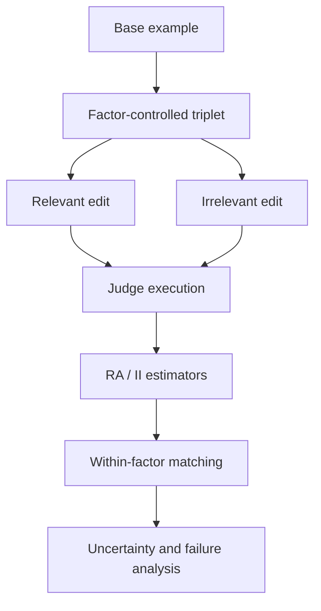

# Architecture

RewardLens evaluates whether multimodal judges with similar static accuracy depend on visual evidence in the same way.

## Measurement contract

- Factors are evaluated separately.
- Relevant and irrelevant edits form controlled interventions.
- Metrics are conditioned on base-correct examples.
- Within-factor matching compares judges at similar static accuracy.
- Reports preserve uncertainty, exclusions, and failed runs.

## Evidence boundary

The repository is a reproducible research workspace. Protocol notes and staged data manifests are not equivalent to completed model runs.
